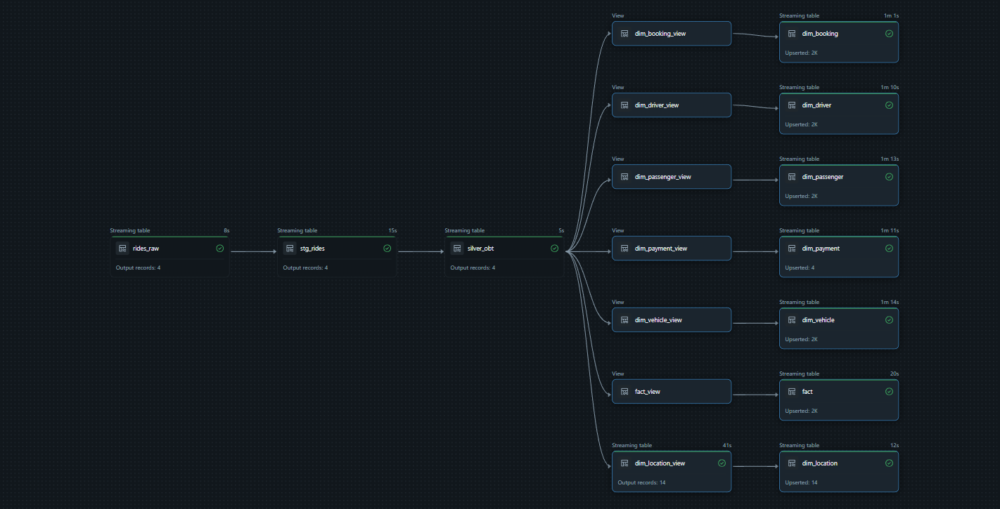

# Uber End-to-End Data Engineering Project (Azure + Databricks)

A hands-on **real-time data engineering pipeline** on **Azure** and **Databricks**, modeled after an Uber-style ride platform. The flow spans event ingestion, lake storage, orchestration, streaming transformation, dimensional modeling, and a consumption-ready **STAR schema**.

This repository currently includes the **Event Hub producer** (synthetic ride events) and **reference dimension mappings**. Downstream stages—ADF ingestion, Databricks streaming, SCD logic, and the gold STAR schema—are part of the full pipeline design documented below.

---

## Architecture Diagram



High-level view of how data moves from producers through Event Hubs, ADF, ADLS Gen2 (Bronze/Silver/Gold), and Databricks into an analytics-ready dimensional model.

---

## Azure Data Factory Pipeline



ADF pipeline that orchestrates ingestion from **Azure Event Hubs** into **ADLS Gen2** (raw/Bronze zone), forming the bridge between streaming ingestion and Databricks processing.

---

## Tech Stack

| Layer | Technology | Purpose |
|---|---|---|
| **Event streaming** | Azure Event Hubs | Kafka-compatible real-time event ingestion |
| **Producer** | Python + `azure-eventhub` | Generate and publish synthetic ride events |
| **Orchestration** | Azure Data Factory (ADF) | Schedule and automate ingestion into the lake |
| **Storage** | Azure Data Lake Storage Gen2 | Bronze (raw), Silver (cleansed), Gold (modeled) zones |
| **Processing** | Apache Spark / PySpark | Distributed transformation and enrichment |
| **Streaming** | Spark Structured Streaming | Continuous processing from the lake |
| **Compute** | Azure Databricks | Managed Spark notebooks and jobs |
| **Modeling** | STAR schema + SCD | Fact/dimension tables for BI and analytics |

---

## What's in This Repo

### Event Hub Publisher (`Event_hub_Publisher/`)

Python scripts that simulate Uber ride confirmations and publish JSON events to Azure Event Hubs.

| File | Role |
|---|---|
| `data.py` | Generates realistic ride records (passenger, driver, vehicle, fare, timestamps) using **Faker** |
| `connection.py` | Sends events to Event Hub via `EventHubProducerClient` |
| `pyproject.toml` | Dependencies (`azure-eventhub`, `faker`, `python-dotenv`, etc.) |

Each event includes identifiers, foreign keys to lookup tables, location and pricing measures, and ride status—structured for downstream fact and dimension modeling.

**Example run:**

```bash
cd Event_hub_Publisher
# Create .env with CONNECTION_STRING and EVENT_HUBNAME
uv sync   # or: pip install -e .
python connection.py
```

### Reference Mappings (`Dataset_Initial/`)

JSON lookup tables used to seed dimension data and align generated events with stable surrogate keys:

- `map_cities.json` — city, state, region
- `map_vehicle_types.json` — UberX, UberXL, rates
- `map_vehicle_makes.json` — vehicle manufacturers
- `map_payment_methods.json` — card, wallet, cash
- `map_ride_statuses.json` — completed / cancelled
- `map_cancellation_reasons.json` — cancellation codes

These mappings mirror the foreign keys embedded in each generated ride event (`vehicle_type_id`, `pickup_city_id`, etc.).

---

## End-to-End Pipeline Stages

| Stage | Component | Status in repo |
|---|---|---|
| 1. Produce events | `Event_hub_Publisher` | Implemented |
| 2. Stream to lake | ADF → ADLS Gen2 Bronze | Documented (see pipeline screenshot) |
| 3. Stream processing | Databricks Structured Streaming | Planned / external notebooks |
| 4. SCD transforms | PySpark Type 1 & 2 | Planned |
| 5. Gold layer | STAR schema (fact + dims) | Planned |

---

## Project Structure

```
Azure_DE_UBER_Stream/
│
├── Event_hub_Publisher/
│   ├── connection.py          # Event Hub producer client
│   ├── data.py                # Synthetic ride event generator
│   ├── files_array.json       # Mapping file manifest
│   └── pyproject.toml         # Python dependencies
│
├── Dataset_Initial/
│   ├── map_cities.json
│   ├── map_vehicle_types.json
│   ├── map_vehicle_makes.json
│   ├── map_payment_methods.json
│   ├── map_ride_statuses.json
│   └── map_cancellation_reasons.json
│
├── ScreenShot/
│   ├── uber_data_engineering_architecture_v3.svg
│   └── Pipeline.png
│
└── README.md
```

---

## How to Run the Event Producer

### Prerequisites

- Azure subscription
- Azure Event Hubs namespace and hub
- Python 3.12+

### Setup

1. **Create Event Hub resources** in Azure Portal (namespace + hub).
2. **Configure credentials** — in `Event_hub_Publisher/`, create a `.env` file:

   ```env
   CONNECTION_STRING=Endpoint=sb://...
   EVENT_HUBNAME=your-event-hub-name
   ```

3. **Install dependencies** and publish a test event:

   ```bash
   cd Event_hub_Publisher
   uv sync
   python connection.py
   ```

4. **Verify ingestion** — confirm events appear in Event Hub metrics or your ADF pipeline monitor before proceeding to lake ingestion.

### Full pipeline setup (Azure)

1. Provision **ADLS Gen2**, **Databricks**, and **Data Factory**.
2. Deploy the ADF pipeline (see screenshot above) with linked services for Event Hub and storage.
3. Run Databricks notebooks for streaming, SCD, and STAR schema build-out.

---

## Data Flow

```
Synthetic ride events (Event_hub_Publisher)
    ↓
Azure Event Hubs
    ↓
Azure Data Factory → ADLS Gen2 (Bronze)
    ↓
Databricks + PySpark Structured Streaming
    ↓
ADLS Gen2 (Silver) — cleansed & enriched
    ↓
SCD Type 1 / Type 2 transforms
    ↓
STAR schema — Gold (analytics-ready)
```

---

## Sample Event Fields

Each ride confirmation JSON includes:

- **Keys:** `ride_id`, `passenger_id`, `driver_id`, `vehicle_id`, location IDs
- **Dimension FKs:** `vehicle_type_id`, `payment_method_id`, `ride_status_id`, `pickup_city_id`, etc.
- **Measures:** `distance_miles`, `duration_minutes`, `total_fare`, `tip_amount`, `surge_multiplier`
- **Timestamps:** `booking_timestamp`, `pickup_timestamp`, `dropoff_timestamp`

---

## Key Concepts Covered

- Apache Kafka patterns via Azure Event Hubs
- Event-driven ingestion and producer design
- Azure Data Factory pipelines and linked services
- Data Lakehouse zones (Bronze / Silver / Gold)
- PySpark Structured Streaming and metadata-driven frameworks
- Slowly Changing Dimensions (Type 1 & 2)
- Dimensional modeling with a STAR schema

---

## References

- [Full Tutorial by Ansh Lamba](https://www.youtube.com/watch?v=5KIbhHo6GJA)
- [Original Code Repository](https://github.com/anshlambagit)
- [Data Engineer Roadmap](https://github.com/anshlambagit/Data_Engineer_Roadmap)

---

## Acknowledgements

Built following the **Uber End-To-End Data Engineering Project (2026)** tutorial by [Ansh Lamba](https://www.youtube.com/@anshlambajsr). Credit for the original pipeline design and architecture goes to the author.

---

## License

Educational use. Fork and extend as needed.
